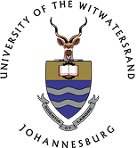
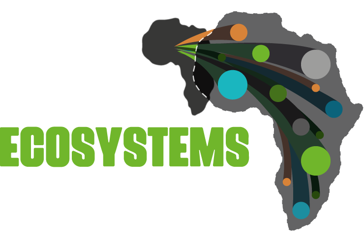
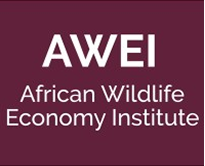
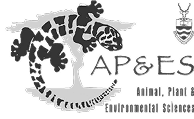
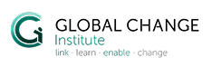
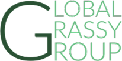
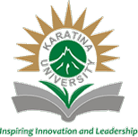
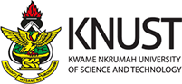
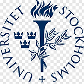
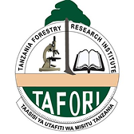

# Funders and Partners

Landscape Decision Theatre is a research tool of the **University of the Witwatersrand**,
developed within the [Future Ecosystems for Africa](https://futureecosystemsafrica.org/)
programme in partnership with [Rewild Capital](https://www.rewildcapital.com/).

-   [{ width="150" }](https://www.wits.ac.za/)

    ---

    **University of the Witwatersrand**

    The institution behind the tool. Scientific direction and the underlying catchment
    research come from Wits, through the
    [African Plant and Ecosystem Science](https://www.wits.ac.za/apes/) and
    [Global Change Institute](https://www.wits.ac.za/gci/) groups.

-   [{ width="150" }](https://futureecosystemsafrica.org/)

    ---

    **Future Ecosystems for Africa**

    The research programme this work sits within, building an African-led evidence base for
    ecosystem management across the continent.

-   [{ width="110" }](https://www.rewildcapital.com/)

    ---

    **Rewild Capital**

    Partner in the FEFA and Rewild Capital Partnership, connecting ecological evidence to
    investment in landscape restoration.

-   [{ width="150" }](https://www.nrf.ac.za/)

    ---

    **National Research Foundation**

    Research funding supporting the science this tool presents.

## Research and implementation partners

The underlying science draws on a network of institutions across Africa and beyond.

-   [{ width="130" }](https://wildlifeeconomy.info/)

    **African Wildlife Economy**

-   [{ width="130" }](https://www.wits.ac.za/apes/)

    **AP-ES**, University of the Witwatersrand

-   [{ width="150" }](https://www.wits.ac.za/gci/)

    **Global Change Institute**, University of the Witwatersrand

-   [{ width="120" }](https://globalgrassygroup.github.io/)

    **Global Grassy Group**

-   [{ width="120" }](https://karu.ac.ke/)

    **Karatina University**, Kenya

-   [{ width="120" }](https://www.knust.edu.gh/)

    **KNUST**, Ghana

-   [{ width="120" }](https://ogresearchconservation.org/)

    **OG Research and Conservation**

-   [{ width="130" }](https://seosaw.github.io/)

    **SEOSAW** — southern African woodlands network

-   [{ width="130" }](https://ogresearchconservation.org/shangani-2/)

    **Shangani Holistic**, Zimbabwe

-   [{ width="140" }](https://www.su.se/english)

    **Stockholm University**, Sweden

-   [{ width="120" }](https://tafori.or.tz/)

    **TAFORI** — Tanzania Forestry Research Institute

## Software development

<figure markdown>
  
  <figcaption class="static">
    How research direction, engineering and funding fit together.
  </figcaption>
</figure>

The application was designed and built by [Kartoza](https://kartoza.com), a South
African open source geospatial consultancy, **under contract to the University of the
Witwatersrand**. Kartoza continues to maintain the software.

The science, the data, the indicator definitions and the direction of the tool are the
work of the research partners above. Kartoza's role is engineering.

## Acknowledgements

This project builds on open source software from many communities. See
[Software Components](../developer-guide/components.md) for the complete list of libraries
and their licences.

---

*If you are interested in funding or partnering on this work, please see
[Contact](contact.md).*
