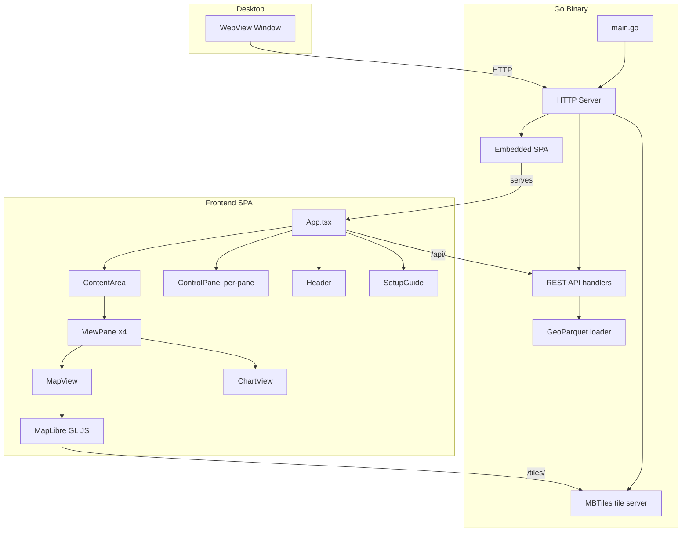

# Architecture Overview

Decision Theatre follows a clean separation between backend (Go), frontend (React/TypeScript), and data layers.

## High-Level Diagram



## Request Flow

1. The Go binary starts an HTTP server on the configured port
2. In desktop mode, a native WebView window opens pointing at `http://localhost:<port>`
3. The server serves the embedded React SPA for all non-API/tile routes
4. MapLibre GL JS requests vector tiles from `/tiles/{z}/{x}/{y}.pbf`
5. The React app calls REST endpoints under `/api/` for scenario data and server info
6. All data is read from local files (MBTiles, GeoParquet)

## Package Layout

```
.
├── main.go                    # Entry point, CLI flags, WebView/headless mode
├── internal/
│   ├── api/
│   │   └── handler.go         # REST API route handlers
│   ├── config/
│   │   └── config.go          # Configuration struct
│   ├── geodata/
│   │   └── geoparquet.go      # GeoParquet file loading
│   ├── models/
│   │   └── models.go          # Shared data models
│   ├── server/
│   │   └── server.go          # HTTP server setup, routing, embed
│   └── tiles/
│       └── mbtiles.go         # MBTiles reader (SQLite)
├── frontend/
│   └── src/
│       ├── App.tsx             # Root component with comparison state
│       ├── components/
│       │   ├── Header.tsx      # App header with status indicators
│       │   ├── MapView.tsx     # MapLibre GL map with swipe
│       │   ├── ControlPanel.tsx # Scenario & attribute selection
│       │   └── SetupGuide.tsx  # Data setup instructions
│       ├── hooks/
│       │   └── useApi.ts       # API client hooks
│       ├── styles/
│       │   └── theme.ts        # Chakra UI theme
│       └── types/
│           └── index.ts        # TypeScript type definitions
├── resources/
│   └── mbtiles/
│       ├── uow_tiles.json      # MapBox GL style
│       └── gpkg_to_mbtiles.sh  # Data conversion script
├── flake.nix                   # Nix build definition
└── Makefile                    # Dev iteration shortcuts
```

## Embedding Strategy

The frontend is built to static files (`frontend/dist/`) and copied into `internal/server/static/` before the Go build. Go's `//go:embed` directive bundles these files into the binary, making it fully self-contained.

## Graceful Shutdown

The application handles `SIGINT` and `SIGTERM` signals. In desktop mode, closing the WebView window also triggers a clean server shutdown.
