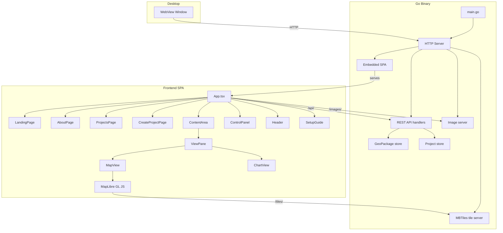
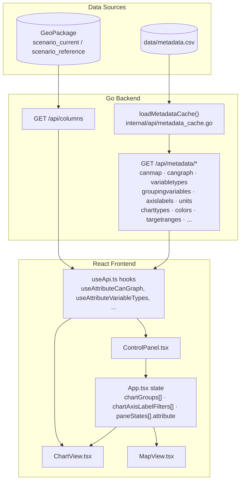
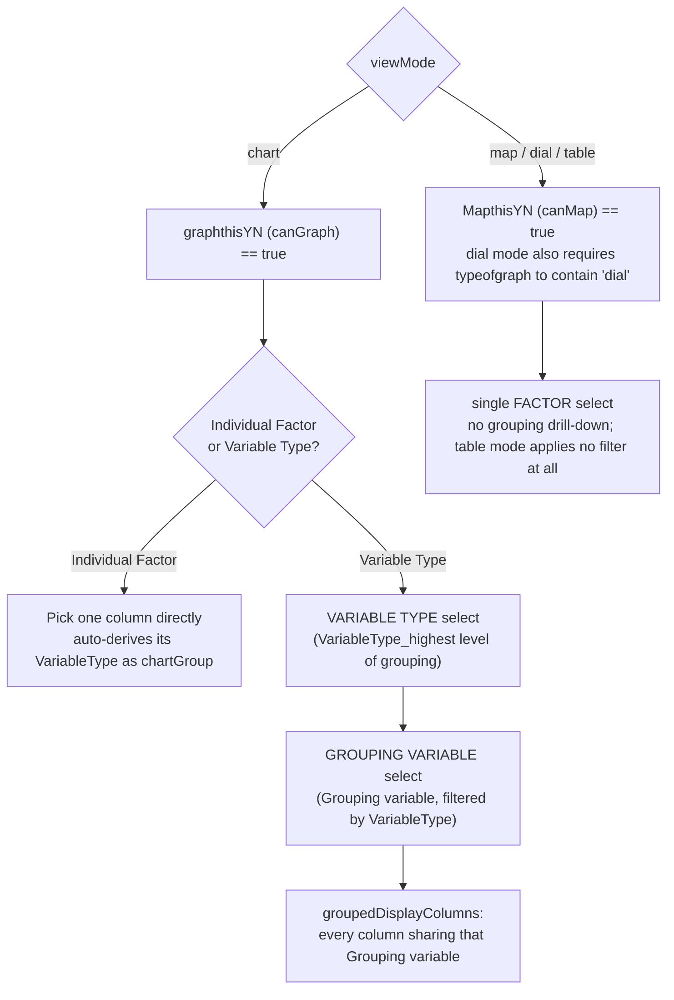

# Architecture Overview

Landscape Decision Theatre follows a clean separation between backend (Go), frontend (React/TypeScript), and data layers.

## High-Level Diagram


```mermaid
graph TB
    subgraph Desktop
        WV[WebView Window]
    end

    subgraph Go Binary
        MAIN[main.go] --> SRV[HTTP Server]
        SRV --> API[REST API handlers]
        SRV --> TILES[MBTiles tile server]
        SRV --> STATIC[Embedded SPA]
        SRV --> IMAGES[Image server]
        API --> GEO[GeoPackage store]
        API --> PROJ[Project store]
    end

    subgraph Frontend SPA
        APP[App.tsx] --> LAND[LandingPage]
        APP --> ABOUT[AboutPage]
        APP --> PROJS[ProjectsPage]
        APP --> CREATE[CreateProjectPage]
        APP --> CA[ContentArea]
        CA --> VP[ViewPane]
        VP --> MAP[MapView]
        VP --> CHT[ChartView]
        APP --> CP[ControlPanel]
        APP --> HDR[Header]
        APP --> SG[SetupGuide]
        MAP --> ML[MapLibre GL JS]
    end

    WV -->|HTTP| SRV
    STATIC -->|serves| APP
    ML -->|/tiles/| TILES
    APP -->|/api/| API
    APP -->|/images/| IMAGES
```

## Request Flow

1. The Go binary starts an HTTP server on the configured port
2. In desktop mode, a native WebView window opens pointing at `http://localhost:<port>`
3. The server serves the embedded React SPA for all non-API/tile routes
4. The user sees the Landing Page and navigates to Projects
5. Project data is loaded/saved via REST endpoints under `/api/projects/`
6. MapLibre GL JS requests vector tiles from `/tiles/{z}/{x}/{y}.pbf`
7. The React app calls REST endpoints under `/api/` for scenario data and server info
8. Choropleth data is queried from the GeoPackage via REST endpoints
9. All data is read from local files (MBTiles, GeoPackage, site JSON files)

## Map Rendering Architecture

The map uses a layered rendering approach:

- **Base layers** (MapLibre GL JS): Ecoregions, countries, rivers, lakes, catchment outlines - served from MBTiles
- **Choropleth layer** (deck.gl): Dynamic polygon fills from GeoPackage data with indicator-based coloring
- **3D extrusion** (optional): Catchments can be extruded based on indicator values

## Factor Selection: `metadata.csv` to Chart View

Every dropdown in the control panel resolves back to one row of `data/metadata.csv`. This section traces that row from disk into the selector a user actually clicks, and shows where Chart View and Map View diverge. For the full column-by-column semantics of `metadata.csv`, see the [Datapack Format](datapack-format.md#metadatacsv-column-reference) reference.


```mermaid
flowchart TB
    subgraph Data Sources
        CSV[("data/metadata.csv")]
        GPKG[("GeoPackage<br/>scenario_current / scenario_reference")]
    end

    subgraph Go Backend
        CACHE["loadMetadataCache()<br/>internal/api/metadata_cache.go"]
        METAAPI["GET /api/metadata/*<br/>canmap · cangraph · variabletypes<br/>groupingvariables · axislabels · units<br/>charttypes · colors · targetranges · ..."]
        COLAPI["GET /api/columns"]
    end

    subgraph React Frontend
        HOOKS["useApi.ts hooks<br/>useAttributeCanGraph, useAttributeVariableTypes, ..."]
        CP["ControlPanel.tsx"]
        STATE["App.tsx state<br/>chartGroups[] · chartAxisLabelFilters[] · paneStates[].attribute"]
        CV["ChartView.tsx"]
        MV["MapView.tsx"]
    end

    CSV --> CACHE --> METAAPI
    GPKG --> COLAPI
    METAAPI --> HOOKS
    COLAPI --> HOOKS
    HOOKS --> CP
    CP --> STATE
    STATE --> CV
    STATE --> MV
    HOOKS --> CV
```

`loadMetadataCache()` parses the CSV once at startup into 15 in-memory maps keyed by `ColumnName` (colours, labels, chart types, grouping variables, target ranges, and so on), each served over its own `GET /api/metadata/*` route. `GET /api/columns` is separate and comes from the GeoPackage, not the CSV — it is the authoritative list of attribute columns that actually exist in the data. A column can exist in the data but never appear in either selector if it is missing from, or zero-flagged in, `metadata.csv`. `ControlPanel.tsx` and `ChartView.tsx` each call the `useApi.ts` hooks independently; there is no shared metadata context, so both must derive from the same underlying maps rather than from shared state.

`ControlPanel.tsx` builds a different selector depending on `viewMode`:


```mermaid
flowchart TD
    VM{viewMode}
    VM -->|chart| CG["graphthisYN (canGraph) == true"]
    VM -->|map / dial / table| CM["MapthisYN (canMap) == true<br/>dial mode also requires typeofgraph to contain 'dial'"]

    CG --> IF{Individual Factor<br/>or Variable Type?}
    IF -->|Individual Factor| ONE["Pick one column directly<br/>auto-derives its VariableType as chartGroup"]
    IF -->|Variable Type| VT["VARIABLE TYPE select<br/>(VariableType_highest level of grouping)"]
    VT --> GV["GROUPING VARIABLE select<br/>(Grouping variable, filtered by VariableType)"]
    GV --> GROUP["groupedDisplayColumns:<br/>every column sharing that Grouping variable"]

    CM --> FACTOR["single FACTOR select<br/>no grouping drill-down; table mode applies no filter at all"]
```

- **Chart View** filters candidate columns by `graphthisYN`. Picking a single factor directly auto-derives its `VariableType_highest level of grouping`; alternatively the user narrows by **VARIABLE TYPE** then **GROUPING VARIABLE**, which selects a whole group of columns to plot together as one grouped line or boxplot chart. A Line/Boxplot toggle appears only when `typeofgraph` for the relevant columns contains `line/boxplot`.
- **Map / Dial / Table View** filters by `MapthisYN` instead, with dial mode further requiring `typeofgraph` to contain `dial`. There is no variable-type/grouping-variable drill-down — just one flat **FACTOR** list. Table mode applies no metadata filter at all.

The resulting selection is written into `App.tsx` state (`chartGroups[]`, `chartAxisLabelFilters[]`, `paneStates[].attribute`) and persisted to `localStorage` (`dt-pane-states`) — identically in both the browser and WebView runtimes, since both talk to the same running Go server for `metadata.csv` data. Only site/scenario persistence differs between runtimes (browser: `localStorage`; WebView: JSON files under `data/sites/`).

`ChartView.tsx` then re-fetches the same metadata hooks independently and intersects `GET /api/columns` with the selected `chartGroup`/`chartAxisLabelFilter` to compute `groupedDisplayColumns`, resolving each column's axis label, units, `x_axis` tick, and `MappreferredColour` to build the final Plotly traces.

## Package Layout

```
.
├── main.go                    # Entry point, CLI flags, WebView/headless mode
├── internal/
│   ├── api/
│   │   └── handler.go         # REST API route handlers
│   ├── config/
│   │   └── config.go          # Configuration struct
│   ├── geodata/
│   │   └── gpkg_store.go      # GeoPackage data access
│   ├── models/
│   │   └── models.go          # Shared data models
│   ├── projects/
│   │   └── projects.go        # Project CRUD operations
│   ├── server/
│   │   └── server.go          # HTTP server setup, routing, embed
│   └── tiles/
│       └── mbtiles.go         # MBTiles reader (SQLite)
├── frontend/
│   └── src/
│       ├── App.tsx             # Root component with page navigation
│       ├── components/
│       │   ├── LandingPage.tsx # Welcome page with hero and navigation
│       │   ├── AboutPage.tsx   # Project information and credits
│       │   ├── ProjectsPage.tsx # Project list and management
│       │   ├── CreateProjectPage.tsx # New project form
│       │   ├── Header.tsx      # App header with status indicators
│       │   ├── MapView.tsx     # MapLibre GL map with swipe
│       │   ├── ControlPanel.tsx # Scenario & attribute selection
│       │   └── SetupGuide.tsx  # Data setup instructions
│       ├── hooks/
│       │   └── useApi.ts       # API client hooks
│       ├── styles/
│       │   └── theme.ts        # Chakra UI theme
│       └── types/
│           └── index.ts        # TypeScript type definitions
├── resources/
│   └── mbtiles/
│       ├── uow_tiles.json      # MapBox GL style
│       └── gpkg_to_mbtiles.sh  # Data conversion script
├── data/
│   ├── projects/              # Project JSON files
│   └── images/                # Project thumbnail images
├── flake.nix                   # Nix build definition
└── Makefile                    # Dev iteration shortcuts
```

## Embedding Strategy

The frontend is built to static files (`frontend/dist/`) and copied into `internal/server/static/` before the Go build. Go's `//go:embed` directive bundles these files into the binary, making it fully self-contained.

## Graceful Shutdown

The application handles `SIGINT` and `SIGTERM` signals. In desktop mode, closing the WebView window also triggers a clean server shutdown.
