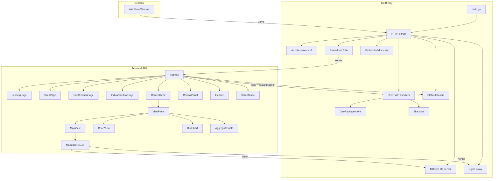
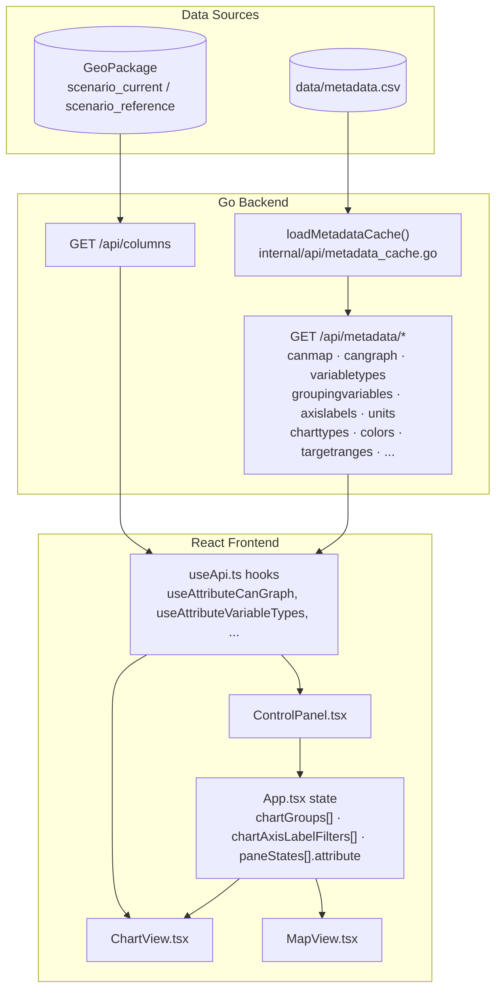
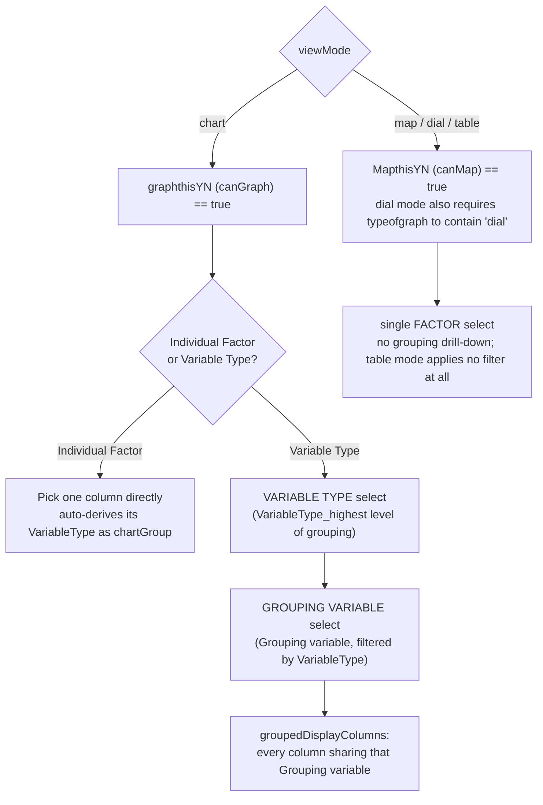

# Architecture Overview

Landscape Decision Theatre separates a Go backend, a React/TypeScript frontend, and a
file-based data layer. The Go binary embeds the built frontend and this documentation
site, so a release ships as a single self-contained executable.

For the rule governing which side of that boundary a given piece of work belongs on, see
[Client/Server Boundary](client-server-boundary.md).

## High-Level Diagram


```mermaid
graph TB
    subgraph Desktop
        WV[WebView Window]
    end

    subgraph Go Binary
        MAIN[main.go] --> SRV[HTTP Server]
        SRV --> API[REST API handlers]
        SRV --> TILES[MBTiles tile server]
        SRV --> AUX[Aux tile servers x3]
        SRV --> GLYPH[Glyph proxy]
        SRV --> STATIC[Embedded SPA]
        SRV --> DOCS[Embedded docs site]
        SRV --> FILES[Static data dirs]
        API --> GEO[GeoPackage store]
        API --> SITE[Site store]
    end

    subgraph Frontend SPA
        APP[App.tsx] --> LAND[LandingPage]
        APP --> SITES[SitesPage]
        APP --> CREATE[SiteCreationPage]
        APP --> IND[IndicatorEditorPage]
        APP --> CA[ContentArea]
        CA --> VP[ViewPane]
        VP --> MAP[MapView]
        VP --> CHT[ChartView]
        VP --> DIAL[DialChart]
        VP --> TBL[AggregateTable]
        APP --> CP[ControlPanel]
        APP --> HDR[Header]
        APP --> SG[SetupGuide]
        MAP --> ML[MapLibre GL JS]
    end

    WV -->|HTTP| SRV
    STATIC -->|serves| APP
    ML -->|/tiles/| TILES
    ML -->|/fonts/| GLYPH
    APP -->|/api/| API
    APP -->|/data/images/| FILES
```

## Runtimes

The same binary and the same SPA serve two runtimes, distinguished at run time by
`frontend/src/types/runtime.ts`:

| Runtime | Window | Site storage |
|---|---|---|
| **WebView (desktop)** | native window opened by `main.go` | JSON files under `data/sites/` |
| **Browser (server)** | user's own browser, `--headless` | `localStorage` |

Both runtimes talk to the same Go server for all analytical work. The browser runtime is
not an offline mode — every indicator extraction, choropleth query and aggregation still
requires the backend.

!!! warning "Expected to change"
    Browser-runtime site storage is being reworked. The client will persist the site
    definition plus a sparse map of user-set values rather than the full per-catchment
    matrix, and is expected to move from `localStorage` to IndexedDB.

    Tickets: *Full per-catchment analytics are persisted client-side at 27-56 KB per
    catchment*, *Move client-side persistence off localStorage onto IndexedDB*.

## Request Flow

1. The Go binary starts an HTTP server on the configured port (default `8080`, `--port` to change).
2. In desktop mode a native WebView window opens pointing at `http://localhost:<port>`.
   With `--headless`, no window is opened and the user browses to the port directly.
3. The server serves the embedded React SPA for all routes not matching an API, tile,
   data or docs prefix.
4. The user lands on the Landing Page and navigates to **Your Sites**.
5. Site data is read and written via `/api/sites/…` in the WebView runtime, or directly
   in `localStorage` in the browser runtime.
6. MapLibre GL JS requests vector tiles from `/tiles/{name}/{z}/{x}/{y}.pbf` and font
   glyphs from `/fonts/{fontstack}/{range}.pbf`.
7. Choropleth, aggregate and comparison data are queried from the GeoPackage over `/api/`.
8. All data is read from local files — MBTiles, GeoPackage, and site JSON.

## Map Rendering Architecture

Each `MapView` creates **two** MapLibre GL instances, left and right, to support swipe
comparison. In grid view the six panes therefore hold up to twelve WebGL contexts.

- **Base layers** (MapLibre GL JS) — ecoregions, countries, rivers, lakes, catchment
  outlines, populated places, served from MBTiles via `/tiles/`.
- **Choropleth layer** — catchment polygons coloured by a data-driven `fill-color`
  expression built in `buildFillColorExpression` (`frontend/src/lib/choroplethPaint.ts`).
  Colouring happens GPU-side; there is no per-feature JavaScript. The polygons reach
  the map by one of two transports, chosen by zoom:

    - **Vector tiles**, from the tiled zoom range up (`catchments_lev12` in
      `africa.mbtiles`, zoom 8-15 as generated). MapLibre fetches and tessellates each
      tile once and reuses it for every later pan, zoom and attribute change. The
      attribute values are fetched separately from `/api/catchment-values` — geometry-free
      — and joined onto the tiles as **feature state**, so switching indicator moves
      values only and never geometry.
    - **GeoJSON**, below the tiled zoom range, from `/api/choropleth`. There the server
      returns grid-aggregated cells rather than catchments (see
      `queryCatchmentsGridAggregated`), which have no tiled equivalent.

    The choice is made from the served TileJSON: if the tileset does not declare a
    `catchments_lev12` layer *with* its zoom range, the GeoJSON path is used at every
    zoom, exactly as before. A datapack built before catchments were tiled keeps working.

- **3D extrusion** (optional) — catchments extruded by indicator value.
- **Site boundary and edit handles** — small GeoJSON sources holding the user's own polygon.

!!! warning "Expected to change"
    The right-hand map is currently created eagerly whether or not the user is comparing,
    and map instances are not released when a pane switches to a non-map view.

    Tickets: *Twelve WebGL contexts are created in grid view and never released*,
    *Clamp devicePixelRatio on low-end devices*.

## Auxiliary Tile Servers

`startAuxTileServers` opens up to three additional listeners on the ports immediately
following the main port, each running a minimal router that serves only `/tiles/…`.
Browsers cap concurrent connections per origin, and grid view issues tile requests from
many map instances at once; spreading them across origins avoids head-of-line blocking.

These auxiliary listeners are started once at boot and are not rebuilt when a data pack
is installed.

!!! warning "Expected to change"
    The auxiliary routers are not rebuilt by `rebuildRoutes`, so their tile route
    survives a data pack install pointing at a store that has been torn down.

    Ticket: *Nil dereference and data race on tileStore during datapack install*.

## Factor Selection: `metadata.csv` to Chart View

Every dropdown in the control panel resolves back to one row of `data/metadata.csv`. This
section traces that row from disk into the selector a user actually clicks, and shows
where Chart View and Map View diverge. For the full column-by-column semantics of
`metadata.csv`, see the
[Datapack Format](datapack-format.md#metadatacsv-column-reference) reference.


```mermaid
flowchart TB
    subgraph Data Sources
        CSV[("data/metadata.csv")]
        GPKG[("GeoPackage<br/>scenario_current / scenario_reference")]
    end

    subgraph Go Backend
        CACHE["loadMetadataCache()<br/>internal/api/metadata_cache.go"]
        METAAPI["GET /api/metadata/*<br/>canmap · cangraph · variabletypes<br/>groupingvariables · axislabels · units<br/>charttypes · colors · targetranges · ..."]
        COLAPI["GET /api/columns"]
    end

    subgraph React Frontend
        HOOKS["useApi.ts hooks<br/>useAttributeCanGraph, useAttributeVariableTypes, ..."]
        CP["ControlPanel.tsx"]
        STATE["App.tsx state<br/>chartGroups[] · chartAxisLabelFilters[] · paneStates[].attribute"]
        CV["ChartView.tsx"]
        MV["MapView.tsx"]
    end

    CSV --> CACHE --> METAAPI
    GPKG --> COLAPI
    METAAPI --> HOOKS
    COLAPI --> HOOKS
    HOOKS --> CP
    CP --> STATE
    STATE --> CV
    STATE --> MV
    HOOKS --> CV
```

`loadMetadataCache()` parses the CSV once at startup into 15 in-memory maps keyed by
`ColumnName` (colours, labels, chart types, grouping variables, target ranges, and so on),
each served over its own `GET /api/metadata/*` route. `GET /api/columns` is separate and
comes from the GeoPackage, not the CSV — it is the authoritative list of attribute columns
that actually exist in the data. A column can exist in the data but never appear in either
selector if it is missing from, or zero-flagged in, `metadata.csv`. `ControlPanel.tsx` and
`ChartView.tsx` each call the `useApi.ts` hooks independently; there is no shared metadata
context, so both must derive from the same underlying maps rather than from shared state.

`ControlPanel.tsx` builds a different selector depending on `viewMode`:


```mermaid
flowchart TD
    VM{viewMode}
    VM -->|chart| CG["graphthisYN (canGraph) == true"]
    VM -->|map / dial / table| CM["MapthisYN (canMap) == true<br/>dial mode also requires typeofgraph to contain 'dial'"]

    CG --> IF{Individual Factor<br/>or Variable Type?}
    IF -->|Individual Factor| ONE["Pick one column directly<br/>auto-derives its VariableType as chartGroup"]
    IF -->|Variable Type| VT["VARIABLE TYPE select<br/>(VariableType_highest level of grouping)"]
    VT --> GV["GROUPING VARIABLE select<br/>(Grouping variable, filtered by VariableType)"]
    GV --> GROUP["groupedDisplayColumns:<br/>every column sharing that Grouping variable"]

    CM --> FACTOR["single FACTOR select<br/>no grouping drill-down; table mode applies no filter at all"]
```

- **Chart View** filters candidate columns by `graphthisYN`. Picking a single factor
  directly auto-derives its `VariableType_highest level of grouping`; alternatively the
  user narrows by **VARIABLE TYPE** then **GROUPING VARIABLE**, which selects a whole group
  of columns to plot together as one grouped line or boxplot chart. A Line/Boxplot toggle
  appears only when `typeofgraph` for the relevant columns contains `line/boxplot`.
- **Map / Dial / Table View** filters by `MapthisYN` instead, with dial mode further
  requiring `typeofgraph` to contain `dial`. There is no variable-type/grouping-variable
  drill-down — just one flat **FACTOR** list. Table mode applies no metadata filter at all.

The resulting selection is written into `App.tsx` state (`chartGroups[]`,
`chartAxisLabelFilters[]`, `paneStates[].attribute`) and persisted to `localStorage`
(`dt-pane-states`) — identically in both runtimes, since both talk to the same running Go
server for `metadata.csv` data. Only site persistence differs between runtimes.

`ChartView.tsx` then re-fetches the same metadata hooks independently and intersects
`GET /api/columns` with the selected `chartGroup`/`chartAxisLabelFilter` to compute
`groupedDisplayColumns`, resolving each column's axis label, units, `x_axis` tick, and
`MappreferredColour` to build the final Plotly traces.

## Package Layout

<figure markdown>
  
  <figcaption class="gen">
    read from the
    <code>internal/</code> import graph. An amber arrow would indicate a layering
    inversion; there are none today.
  </figcaption>
</figure>

```
.
├── main.go                       # Entry point, CLI flags, WebView/headless mode
├── internal/
│   ├── api/                      # REST handlers, metadata cache, recalculation
│   │   ├── handler.go            # Route registration and HTTP handlers
│   │   ├── metadata_cache.go     # metadata.csv parsing and lookup maps
│   │   ├── lookups.go            # Lookup table loading (herbivore traits, NPP/SOC)
│   │   ├── recalculate.go        # Ecological recalculation workflows
│   │   └── warnings.go           # Target-state warning rules
│   ├── config/                   # Platform config/data dirs, settings.json
│   ├── geodata/                  # GeoPackage queries, choropleth, grid aggregation
│   │   └── gpkg_store.go         # The bulk of the spatial and aggregation logic
│   ├── httputil/                 # JSON response helpers
│   ├── server/                   # HTTP server, routing, embeds, datapack install
│   │   ├── server.go             # Routing, tile serving, style/glyph endpoints
│   │   └── datapack.go           # Data pack download, install, extraction
│   ├── sites/                    # Site JSON persistence, thumbnails, bounding boxes
│   └── tiles/                    # MBTiles reader (SQLite) and tile cache
├── frontend/
│   └── src/
│       ├── App.tsx               # Root component, page routing, global state
│       ├── components/           # 27 components (see Software Components)
│       ├── hooks/
│       │   ├── useApi.ts         # API client and site persistence
│       │   └── useMapSync.ts     # Left/right map viewport synchronisation
│       ├── lib/                  # mapBounds.ts, ttlCache.ts
│       ├── utils/                # indicators.ts (AOI weighting), warnings.ts
│       ├── constants/            # calculationFormulas.ts, walkthroughSites.ts
│       ├── styles/               # theme.ts, colors.ts
│       └── types/                # index.ts, runtime.ts
├── data/                         # Data pack contents (not in version control)
│   ├── mbtiles/                  # *.mbtiles + style.json
│   ├── sites/                    # Site JSON files (WebView runtime)
│   ├── images/                   # Site thumbnails
│   ├── walkthroughs/             # Read-only demo site JSON
│   └── demo/                     # Demo assets for guided tours
├── docs/                         # This documentation site (MkDocs)
├── flake.nix                     # Nix build definition
└── Makefile                      # Dev iteration shortcuts
```

!!! note "`internal/webview_go/`"
    A vendored copy of the webview library also exists in the tree. Its `replace`
    directive is commented out in `go.mod`, so nothing imports it and it is not part of
    the build. It is slated for removal — ticket *Delete dead Go code — unreachable WKB
    parser and the vendored webview tree*.

## Embedding Strategy

The frontend is built to static files (`frontend/dist/`) and copied into
`internal/server/static/` before the Go build. The MkDocs site is built and copied to
`internal/server/docs_site/`. Go's `//go:embed` directive bundles both into the binary,
making it fully self-contained and serving the docs at `/docs/`.

Because `internal/server/static/` is a build artefact and is not committed, `go build`,
`go vet` and `go test` on a clean checkout require the frontend to be built first. See
[Development Environment](dev-environment.md).

## Graceful Shutdown

The application handles `SIGINT` and `SIGTERM`. In desktop mode, closing the WebView
window also triggers a clean server shutdown, closing the MBTiles and GeoPackage handles.
