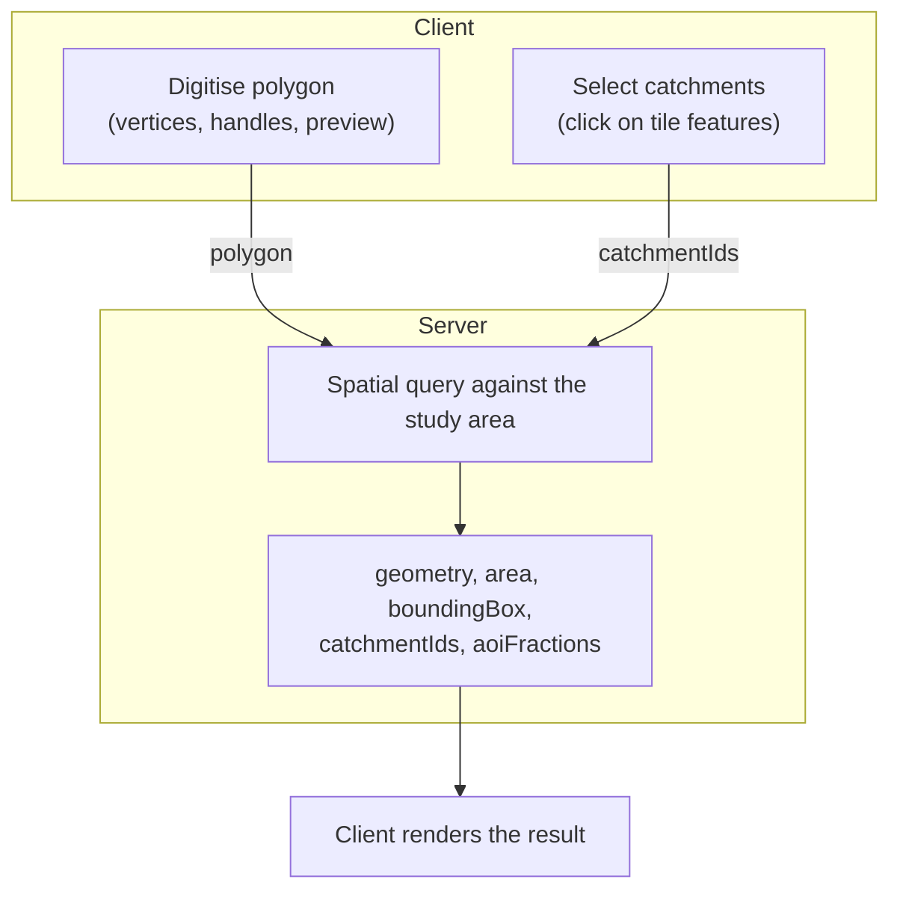

# Client/Server Boundary

This note defines what may be computed and stored in the browser, and what belongs
in the Go backend. It exists because the boundary drifted: analytical results and
geometry algebra that the backend already owns ended up duplicated on the client,
which is the direct cause of the storage exhaustion and interface stalls users have
reported.

See also [Architecture Overview](architecture.md) for the component layout.

## The rule

<figure markdown>
  
  <figcaption class="static">
    Anything that scales with the size of the study area belongs on the server.
  </figcaption>
</figure>


> **Client:** capturing and editing the user's own polygon — vertices, rubber-band
> preview, drag handles. One shape, a few kilobytes, with no reference to the study
> area.
>
> **Server:** anything whose input is the study area — dissolve, area, bounding box,
> catchment membership, overlap fractions, aggregation — **regardless of which
> creation method produced the polygon.**

The second clause is the one that is easy to get wrong. Both site-creation methods
converge on the same server-side spatial query; they simply arrive from different
directions. Selection sends catchment IDs, digitising sends a polygon, and both
receive back `{geometry, area, boundingBox, catchmentIds, aoiFractions}`.

Digitising a boundary point by point is entirely a client concern. The question asked
*immediately after* digitising — "which catchments does this cover, and by how much?" —
is not, and has nothing to do with how the polygon was produced.



## What legitimately lives client-side

Every GeoJSON source added in the browser should be the user's own in-progress
geometry. There are currently six, and five qualify:

| Source | Content | Size |
|---|---|---|
| `SiteCreationMap.tsx` `drawing-preview` | rubber-band polygon while drawing | a few vertices |
| `SiteCreationMap.tsx` site preview | boundary being previewed | one polygon |
| `SiteCreationMap.tsx` `selected-catchments` | catchments the user has clicked | see note below |
| `MapView.tsx` `SITE_BOUNDARY_SOURCE` | the site outline | one polygon |
| `MapView.tsx` `EDIT_VERTICES_SOURCE` | vertex handles while editing | a handful of points |
| `MapView.tsx` `choropleth-source-*` | **the study-area matrix** | **does not qualify** |

`selected-catchments` is a legitimate piece of local interaction state, but its
geometry should come from `queryRenderedFeatures` against the tile the map has already
decoded — never from a separate fetch. Once the choropleth is served as vector tiles,
those features are available for free.

## Client state is a sparse overlay, not the matrix

The only genuinely user-authored analytical data is the values the user typed: `ideal`
and its bounds, and the reference bounds exposed in the indicator editor. Everything
else — reference values, current values, catchment areas, AOI fractions — is derived
from the datapack and is reproducible on the server from `(siteId, catchmentIds)`.

So a persisted site is its definition plus a sparse override map:

```json
{
  "id": "…",
  "title": "…",
  "geometry": { "type": "Polygon", "coordinates": [ … ] },
  "creationMethod": "drawn",
  "catchmentIds": [ … ],
  "overrides": { "1121879850": { "NPP_gm2": 412.3 } }
}
```

An override entry costs roughly 40 bytes. A user who edits fifty values across twenty
catchments produces about 2 KB.

Store the dense per-catchment matrix instead and the same site costs **27–56 KB per
catchment** — measured against the tracked walkthrough files. Against a typical 5 MB
localStorage quota, a single site of roughly 90–185 catchments consumes all available
storage.

!!! note "The overlay already exists as a temporary"
    `MapView.tsx` builds `browserIdealOverrides` / `siteIdealOverrides` as
    `Map<catchmentId, number>` — exactly the right structure. It is currently *derived*
    from the dense matrix by loading the whole thing and discarding all but one
    attribute, once per attribute, per pane, per colour pass. Promoting it to the
    stored form is mostly deletion.

## localStorage is not a database

Every analytical operation requires the backend in both runtimes. `fetchChoroplethData`
calls `/api/choropleth`; browser-runtime site creation POSTs to
`/api/sites/{id}/indicators` to have indicators computed. The application cannot
function without the server.

Client storage therefore buys no offline capability. Using it as the primary store for
derived data is the category error underneath the reported symptoms. Persist user
intent; refetch everything else.

## Worked example: the two creation paths

### Selection → outline (correct today)

`POST /api/sites/dissolve-catchments` accepts `{catchmentIds}` and returns
`{geometry, boundingBox, area}`. The client sends IDs and renders the returned GeoJSON.
No geometry algebra runs in the browser.

For catchment-selected sites every AOI fraction is 1.0 by construction — each catchment
is wholly inside the boundary — so no intersection maths is required at all.

### Digitising → catchment membership (currently client-side)

`SiteCreationPage.tsx` loops over candidate catchments performing, in JavaScript, a
`turfSimplify`, a `turfArea`, an `intersect` against the boundary and an overlap-fraction
calculation, per catchment.

The backend already implements this: `GpkgStore.ApplyAOIFractions(catchments, geometry)`
takes a polygon and returns per-catchment AOI fractions, against an R-tree-indexed
geopackage. The client work duplicates existing Go rather than filling a gap, and it is
the reason for the `colorTotalFeatures <= 50` cutoff in `MapView.tsx`, above which the
site-catchment set silently comes back empty.

Correctness that degrades with dataset size is the signature of computation sitting in
the wrong tier.

## Anti-patterns

**Geometry algebra in the browser.** `union`, `difference`, `intersect`, `area` and
`simplify` are imported from turf in `MapView.tsx` and `SiteCreationPage.tsx`, while Go
implements the same operations via polyclip (`DissolveCatchments`, `signedRingArea`).
Two implementations of the same algebra in two languages, with the slower one running on
the user's machine. The comments in `MapView.tsx` concede the cost directly:
"O(n × polygon_complexity) turf.intersect calls that block the main thread."

**Bulk geometry as a GeoJSON source.** The choropleth is fetched per viewport, parsed on
the main thread, tessellated and uploaded — once per map instance, and there are two per
pane. This belongs in the tile pipeline. The colour application is already correct and
should be preserved: `buildFillColorExpression` produces a data-driven paint expression
applied with `setPaintProperty`, so colouring happens GPU-side with no per-feature
JavaScript. That approach ports directly onto a vector-tile source.

**A values table shaped like GeoJSON.** `valuesOnly` responses emit
`"geometry": null` for all 147,837 features, spending 114 bytes to carry one ID and one
float. A columnar `{ids: [...], values: [...]}` carries identical information in roughly
a fifth of the bytes. If a response has no geometry, it is not a `FeatureCollection`.

## Sizing reference

Measured against `data/datapack.gpkg` and the tracked walkthrough files. Reproduce with:

```bash
sqlite3 -readonly data/datapack.gpkg "SELECT COUNT(*) FROM catchments_lev12;"
jq '.catchments|length' data/walkthroughs/*.json
```

| Quantity | Value |
|---|---|
| Catchments in the datapack | 147,837 |
| Indicator keys per scenario, per catchment | 502 |
| Dense per-catchment record | 27–56 KB |
| Sparse override entry | ~40 bytes |
| Full `valuesOnly` response, uncompressed | 16.1 MB |
| `JSON.parse` of that response | ~133 ms (desktop V8, warm) |
| Typical localStorage quota | ~5 MB, counted in UTF-16 code units |

## Checklist for new work

Before adding a fetch, a store write or a geometry call, ask:

- [ ] Does this compute something derivable from the datapack? → server
- [ ] Does its input include more than one catchment? → server
- [ ] Is the response a `FeatureCollection` with null geometry? → make it columnar
- [ ] Am I persisting something the server can regenerate? → don't
- [ ] Is this geometry the user is editing right now? → client is correct
- [ ] Does it scale with the size of the study area? → it does not belong in the browser
