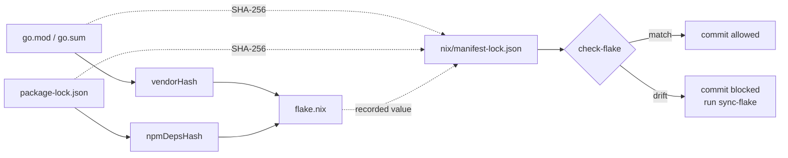

# Keeping the Flake Importable

This flake is meant to be usable as an input to somebody else's flake. That imposes one
obligation that is easy to break and hard to notice:

!!! danger "The rule"
    `flake.nix` must always be in step with `go.mod`, `go.sum` and
    `frontend/package-lock.json`. If it is not, **everyone importing this flake fails to
    build**, and nothing on the machine that caused it will say so.

## Why it is easy to break

`flake.nix` pins two fixed-output derivations:

| Attribute | Derived from | Pins |
|---|---|---|
| `vendorHash` | `go.mod`, `go.sum` | the vendored Go module set |
| `npmDepsHash` | `frontend/package-lock.json` | the npm dependency tree |

A fixed-output derivation is only re-verified when its **output path changes**, and that
path embeds the version. So after adding a Go dependency without updating `vendorHash`:

- your build succeeds — the vendored output for that path is already in your store, so
  nothing refetches or revalidates it;
- every build on that machine keeps succeeding, for the same reason;
- a fresh CI runner, or anyone importing the flake, has a cold store. Nix fetches, hashes
  the result, compares it to the recorded value, and **fails**.

This is not hypothetical. The `vendorHash` on `main` was stale before 0.3.0 and went
unnoticed for exactly this reason; it only surfaced when a version bump changed the output
path and forced revalidation.

## How the project prevents it

<figure markdown>



<figcaption class="static">
The lock file records which manifests each hash was computed from, so drift is caught
offline in milliseconds rather than on somebody else's cold build.
</figcaption>
</figure>

Recomputing the real hashes needs the network and, for Go, a build — far too slow to sit
in front of every commit. So `nix/manifest-lock.json` records a SHA-256 of each manifest
at the moment its hash was computed:

```json
{
  "vendorHash": {
    "value": "sha256-4ZfPWJtJfZtF4YsKdMq7Nxo+uSxhna4FzWh/WCC/aY0=",
    "inputs": {
      "go.mod": "3156a949218646f1df4926d7959f4573944c715d5d437669d456a4e25126a347",
      "go.sum": "8654d4849909d5fa589534977ec4411196cebc884254f88a47e5f158325128d8"
    }
  }
}
```

The fast check recomputes those digests and compares. It can produce a needless resync; it
cannot produce a false pass.

## What to run

| Command | Speed | What it does |
|---|---|---|
| `dt check-flake` | instant, offline | Have the manifests moved since the hashes were computed? |
| `dt sync-flake` | ~1 minute, networked | Recompute both hashes, write them into `flake.nix`, record the digests |
| `dt verify-flake` | slow, networked | Recompute the hashes and confirm the recorded ones are actually right |
| `dt doctor` | instant | The above fast check, plus everything else about the checkout |

**After changing any dependency:**

```bash
go get example.com/pkg      # or: cd frontend && npm install pkg
dt sync-flake
git add flake.nix nix/manifest-lock.json
```

Commit the two files **together**. They record the same fact, and a commit that moves one
without the other leaves the record describing a hash that is no longer there.

## Where it is enforced

Three layers, each catching what the previous one might miss:

1. **Pre-commit hook** — `dt check-flake` runs before every commit, plus a check that
   `flake.nix` and `nix/manifest-lock.json` are staged together whenever a hash line
   changed. Install with `dt hooks`.
2. **CI, first job** — `flake-lock-step` runs the fast check *and* the deep verify before
   any other job. It fails in seconds with the exact command to run, rather than at the
   end of a full build with a hash mismatch.
3. **CI, `import-flake`** — builds this flake the way an external consumer would, from a
   store that is cold for our derivations. This proves the conclusion that actually
   matters: a third party can import it and build.

## Bootstrapping

`dt sync-flake --adopt` records the hashes already in `flake.nix` as belonging to the
manifests as they stand, without recomputing them. It exists for two situations: creating
the lock file for the first time on a repository whose hashes are already known good, and
machines where a networked fixed-output derivation cannot be built.

It bootstraps the record. It cannot discover a wrong hash — follow it with
`dt verify-flake` where you can.

## If the check fails

```
✗ Go modules    changed since vendorHash was computed: go.sum
                run 'dt sync-flake' — otherwise a cold-store build of this flake fails
```

Run `dt sync-flake` and commit both files. If it reports that `flake.nix` was edited
without resyncing, someone changed a hash by hand; `dt sync-flake` will put it right.

If the two `npmDepsHash` occurrences disagree, they were edited individually —
`sync-flake` writes every occurrence, so it fixes that too.
