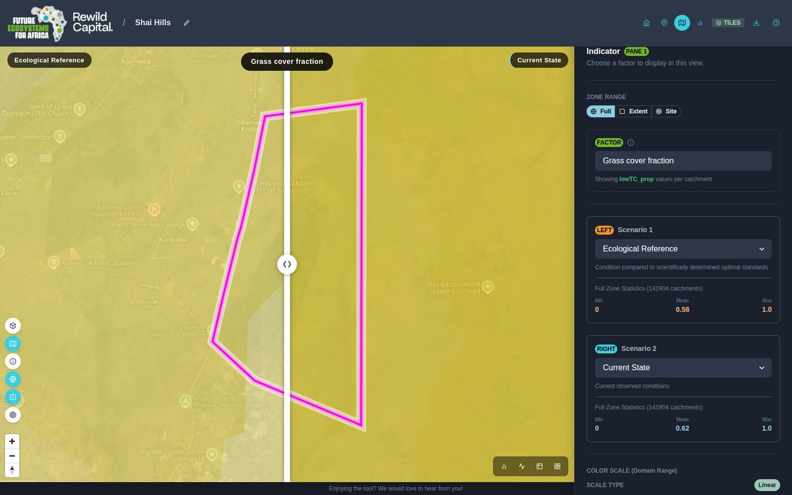
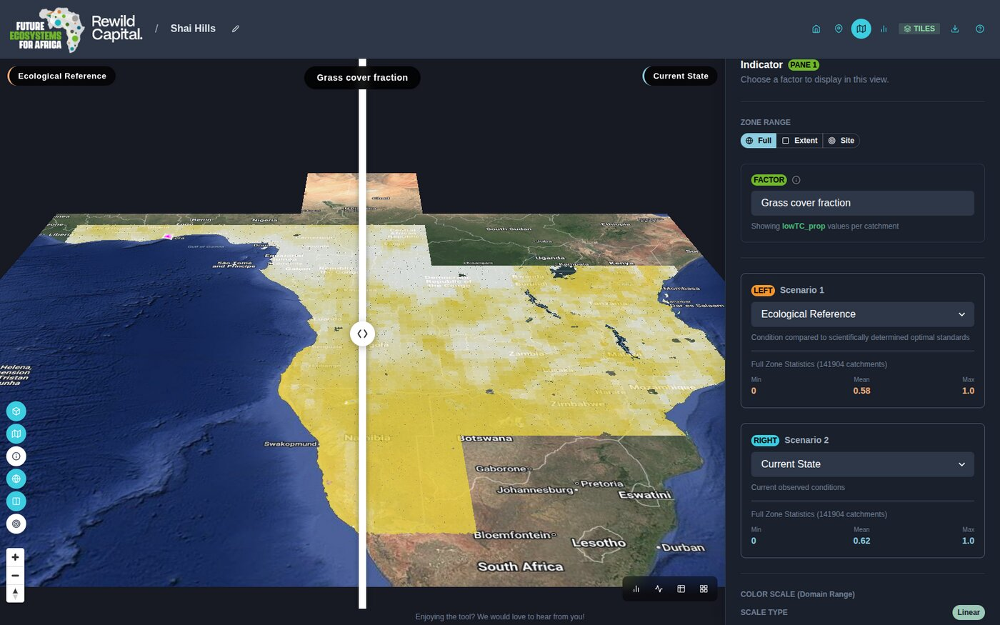

# Step 4 — Open the map

!!! abstract "Goal"
    Get to the map workspace and learn its controls.

## Background

The map is the core workspace. Everything else — charts, dials, tables — is a different
lens on the same selection you make here.

You can reach it either by opening a site, or through **Explore** mode with no site at
all.

<figure markdown>
  
  <figcaption class="gen">
    Your place in the guide.
  </figcaption>
</figure>

## Steps

1. Either open a site from **My Sites**, or click **Explore the Future of
   Ecosystem Decision-Making** on the landing page.
2. You arrive in single-pane view with the indicator panel open on the right.

### Map controls

Each map pane carries its own floating toolbar:

| Control | What it does |
|---|---|
| **Toggle 3D view** (cube) | Tilts to a 60° pitch and extrudes catchments as 3D bars scaled to the chosen factor |
| **Toggle choropleth layer** (map) | Shows or hides the coloured data overlay |
| **Toggle identify mode** (info) | Click-to-inspect a catchment — single-pane view only |
| **Toggle Google basemap** (globe) | Switches between the vector basemap and satellite imagery |
| **Toggle map swiper** (columns) | Shows or hides the divider between the two compared scenarios |
| **Zoom to Site** (target) | Fits the map to the site boundary |

### Seeing it in three dimensions

The 3D toggle extrudes each catchment to a height proportional to the selected factor,
which makes outliers obvious in a way flat colour does not.

!!! success "What you achieved"
    - You can reach the map with or without a site
    - You know what each map control does
    - You have seen the data extruded in 3D

[:material-arrow-left: Step 3 — Take a guided tour](take-a-guided-tour.md){ .md-button }

[Step 5 — Choose what to show :material-arrow-right:](choose-what-to-show.md){ .md-button .md-button--primary .next-step }

