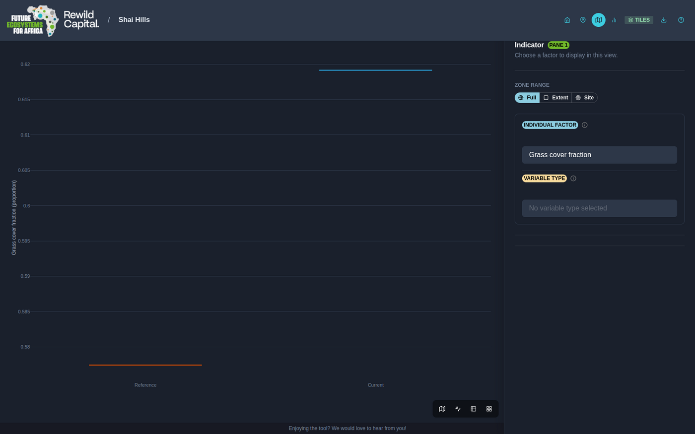
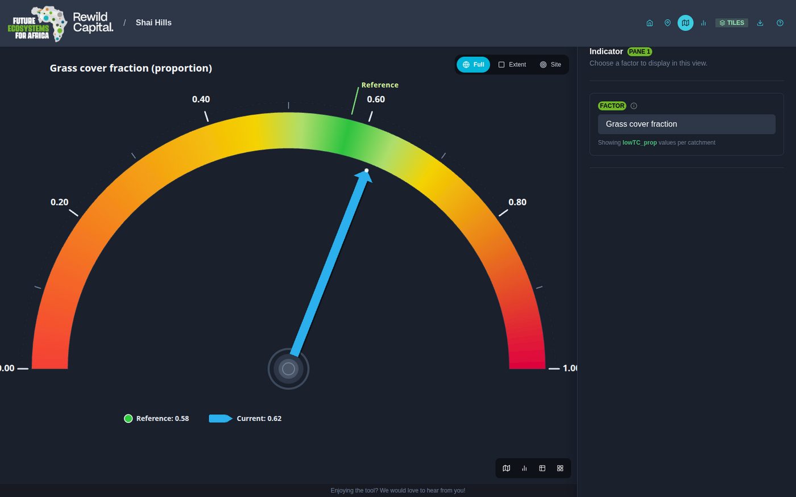
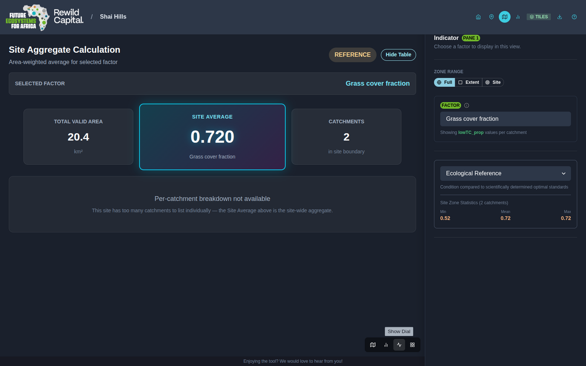

# Step 8 — Read the data four ways

!!! abstract "Goal"
    Switch a pane between map, chart, dial and table.

## Background

The same selection can be read four ways, and each answers a different question: *where*,
*how does it trend*, *how far from healthy*, and *which catchments contribute*.

Switching view does not change your factor or scenario choices — only how they are
drawn.

<figure markdown>
  
  <figcaption class="gen">
    Your place in the guide.
  </figcaption>
</figure>

<figure markdown>
  
  <figcaption class="static">
    Read the data four ways.
  </figcaption>
</figure>

## Steps

Use the pane's own toolbar, bottom-right, to switch modes.

### Chart view

A line or box-and-whisker plot of Reference, Current and Target for the chosen factor.

- **Summary mode** — one factor, one three-point comparison.
- **Grouped mode** — choose a **Variable Type** instead of a single factor to chart every
  related factor at once, narrowing further with a **Grouping Variable**. A
  **Line / Whisker Boxplot** toggle appears when the data supports it. Widely spread axes
  switch to a logarithmic scale automatically, and large grouped charts paginate.

### Dial view

A semicircular gauge for a single factor: an at-a-glance read of how far Current and
Target sit from the ecological reference.

The green band marks the healthy reference zone, fading to yellow and red toward the
extremes. The solid blue needle is **Current**; a dashed green needle appears once
**Target** differs from it.

### Table view

The **Site Aggregate Calculation** — the area-weighted average of the chosen factor across
every catchment in the site.

Summary cards show total valid area, the site average, and catchment count. **Show Table**
reveals the per-catchment breakdown with the underlying formula — unless the site has too
many catchments to list, in which case only the site average is shown.

!!! success "What you achieved"
    - You can switch a pane between all four view modes
    - You know which question each mode answers best
    - You can chart a whole group of related factors at once

[:material-arrow-left: Step 7 — Identify a catchment](identify-a-catchment.md){ .md-button }

[Step 9 — Work with several panes :material-arrow-right:](work-with-several-panes.md){ .md-button .md-button--primary .next-step }

