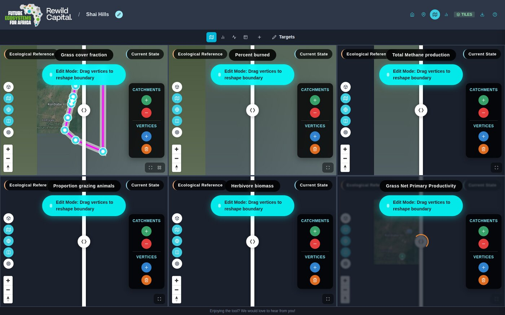

# Step 14 — Refine a boundary

!!! abstract "Goal"
    Adjust a site's shape after the fact.

## Background

Study areas rarely survive first contact with the data. Boundary editing lets you add or
remove whole catchments, or move individual vertices, without recreating the site.

Indicators are re-extracted automatically for the new shape.

<figure markdown>
  
  <figcaption class="gen">
    Your place in the guide.
  </figcaption>
</figure>

## Steps

1. Open the site, then click the **pencil** (Edit site boundary) in the header.
2. A banner explains the active tool, and a floating panel offers two independent tool
   pairs.

| Tool | What it does |
|---|---|
| **Add / Remove catchments** (green + / red −) | Click a catchment to union it into, or subtract it from, the boundary |
| **Add / Delete vertices** (blue + / orange trash) | Click the boundary line to insert a vertex, or an existing vertex to remove it |

3. With no tool selected, drag the glowing cyan vertex handles directly to reshape the
   boundary.
4. Click the pencil again to leave edit mode.

!!! warning "There is no confirm step"
    Edits apply immediately as you drag or click — there is no separate Save or Cancel.
    When you exit edit mode, indicators are automatically re-extracted if the boundary
    changed.

!!! success "What you achieved"
    - You can add and remove catchments from a boundary
    - You can insert, move and delete individual vertices
    - You know edits apply immediately and trigger re-extraction

[:material-arrow-left: Step 13 — Set target values](set-target-values.md){ .md-button }

[Interface reference :material-arrow-right:](../user-guide/reference.md){ .md-button .md-button--primary .next-step }

