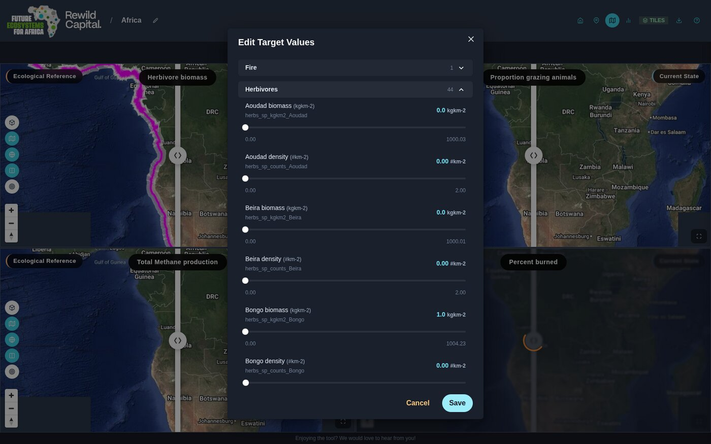

# Step 13 — Set target values

!!! abstract "Goal"
    Say what you are aiming for, and see what it implies.

## Background

This is the point of the tool. Setting a target is not just annotation — the application
recalculates the ecological consequences, so changing tree cover moves the factors that
depend on it.

Target State starts equal to Current State. It only diverges where you make it.

<figure markdown>
  
  <figcaption class="gen">
    Your place in the guide.
  </figcaption>
</figure>

<figure markdown>
  
  <figcaption class="static">
    Set target values.
  </figcaption>
</figure>

## Steps

### Quick edit — the Targets panel

1. In grid view, once the site has indicators, click **Targets** in the top toolbar. The
   editor docks into the right-hand side panel and the views shrink to make room, so the
   dials, charts and maps stay visible while you work.

2. Values are grouped by category — Fire, Herbivores, Vegetation Structure and so on — in
   a collapsible accordion.
3. Expand a group to reveal a labelled slider per indicator, showing its current value,
   unit and allowed range.
4. Drag a slider. Only the ones you actually move are applied, and there is nothing to
   save — the recalculation happens as you go. Dragging a slider back to where it started
   clears the target you set for it.

!!! tip "Live update"
    A recalculation rescores every catchment in the site, so what it costs depends on how
    big the site is. The **Live update** box at the top of the panel decides when it runs:
    ticked, the sliders and the charts behind them recalculate continuously as you drag;
    cleared, they wait until you let go.

    It starts ticked on sites of 20 catchments or fewer and cleared on larger ones. Tick
    or clear it yourself and that choice sticks — across sites and across sessions — so a
    large site can be dragged live if your machine keeps up, and a small one need not
    be.

### Full editor — the Indicators page

For finer control, use the Indicators page from the previous step, which exposes every
indicator with its bounds.

### Seeing the result

Set **Scenario 2 (Right)** to **Target State** and the map, chart, dial and table all
redraw against your target rather than current conditions.

!!! warning "Targets are checked for plausibility"
    Saving a target that is not ecologically plausible raises a warning — for example
    setting grazing intake more than ten times current plant productivity shows
    *"Herbivore consumption is higher than available biomass."* This is an early-stage
    check and more rules may be added.

!!! success "What you achieved"
    - You can set target values for any indicator
    - You can choose whether the landscape recalculates as you drag or after
    - You have seen dependent factors recalculate
    - You can compare Target State against Current on any view

[:material-arrow-left: Step 12 — Review your indicators](review-your-indicators.md){ .md-button }

[Step 14 — Refine a boundary :material-arrow-right:](refine-a-boundary.md){ .md-button .md-button--primary .next-step }

