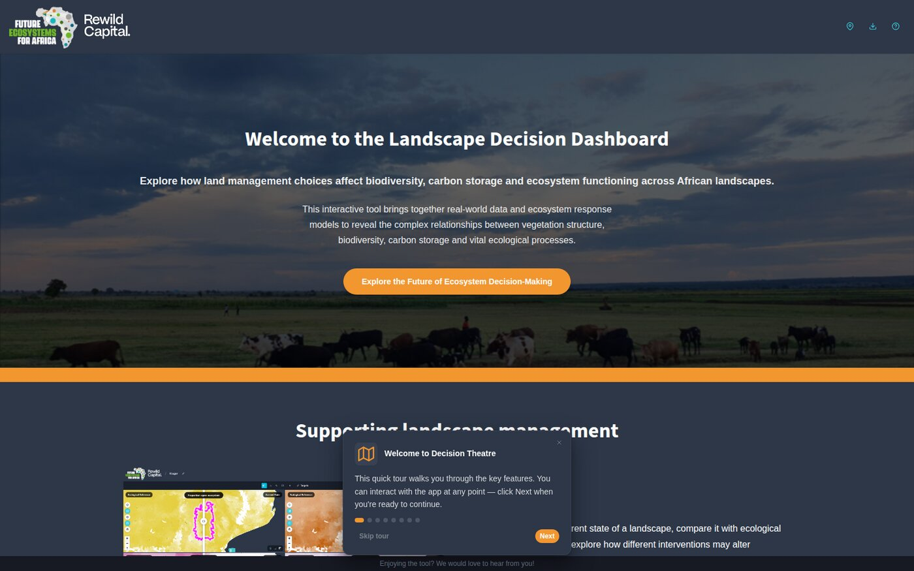

---
hide:
  - navigation
  - toc
---

University of the Witwatersrand · Future Ecosystems for Africa

# Explore the possibilities of sustainable land use

Compare African catchment data across reference, current and target scenarios — on a map,
in charts, on dials, and in the numbers behind them.

[:material-rocket-launch: Open the dashboard](https://africanlandscapefutures.wits.ac.za/){ .kz-cta__primary }
[:material-book-open-variant: Start the guide](guide/index.md){ .kz-cta__secondary }
[:fontawesome-brands-github: GitHub](https://github.com/kartoza/DecisionTheatre){ .kz-cta__secondary }

[{ .kz-figure }](https://africanlandscapefutures.wits.ac.za/)

## What it is

Landscape Decision Theatre is a decision-support tool for freshwater catchment management
across Africa. It puts roughly **148,000 catchments** and their indicators in front of
researchers, policy makers and stakeholders, so a question like *what happens to methane
production if we restore tree cover here?* can be asked and answered in one session.

You define a **site** — a study area — once. Every view, statistic and target is then
computed for it: an area-weighted aggregate over exactly the catchments your boundary
covers.

Nothing needs installing. It runs at
[africanlandscapefutures.wits.ac.za](https://africanlandscapefutures.wits.ac.za/).

-   :material-map-outline:{ .lg .middle } **Start here**

    ---

    Fourteen short steps from opening the dashboard to setting your own targets. No
    installation, no configuration.

    [:octicons-arrow-right-24: The guide](guide/index.md)

-   :material-compass-outline:{ .lg .middle } **Look something up**

    ---

    Every control, panel and toolbar explained, with screenshots.

    [:octicons-arrow-right-24: Interface reference](user-guide/reference.md)

-   :material-database-cog-outline:{ .lg .middle } **Run or deploy it**

    ---

    Assemble and validate a data directory, or serve the application to others.

    [:octicons-arrow-right-24: Administrator guide](administrator-guide/index.md)

-   :material-code-braces:{ .lg .middle } **Change the code**

    ---

    A Nix flake pins the whole toolchain. Architecture, testing, release process.

    [:octicons-arrow-right-24: Developer guide](developer-guide/architecture.md)

## What you can do with it

-   :material-layers-triple-outline:{ .lg .middle } **Compare scenarios**

    ---

    Ecological reference, current state and your own target state — side by side under a
    draggable divider, on one synchronised map.

-   :material-chart-box-outline:{ .lg .middle } **Read it four ways**

    ---

    Choropleth map, line and boxplot charts, dial gauges against a healthy range, and the
    per-catchment table behind the aggregate.

-   :material-vector-polygon:{ .lg .middle } **Define a study area**

    ---

    Draw it, select whole catchments, or upload a shapefile or GeoJSON. The server works
    out membership and overlap.

-   :material-target:{ .lg .middle } **Set targets**

    ---

    Change an ideal value and the ecological consequences recalculate — dependent factors
    move with it, and implausible targets raise a warning.

-   :material-view-grid-outline:{ .lg .middle } **Watch several factors at once**

    ---

    Up to six independent panes, each with its own factor, scenario and view mode.

-   :material-school-outline:{ .lg .middle } **Learn from real examples**

    ---

    Four guided tours over prepared demo sites — Munywana, Viphya, Shai Hills and a
    continent-scale Africa view.

## Built on

-   :material-language-go:{ .lg .middle } **A single Go binary**

    ---

    HTTP server, tile server and the analytical engine — with the interface and this
    documentation embedded. No database or runtime to install.

-   :material-map:{ .lg .middle } **Vector tiles**

    ---

    MapLibre GL JS over MBTiles, with a GeoPackage carrying the scenario data and a spatial
    index behind every viewport query.

-   :material-nix:{ .lg .middle } **A reproducible toolchain**

    ---

    A Nix flake pins Go, Node, the documentation toolchain and the geospatial utilities, so
    a checkout builds identically anywhere.

A research tool of the [University of the Witwatersrand](https://www.wits.ac.za/), developed
within [Future Ecosystems for Africa](https://futureecosystemsafrica.org/) in partnership
with [Rewild Capital](https://www.rewildcapital.com/).
See [Funders and Partners](about/funders-and-partners.md).

Software made with 💗 by [Kartoza](https://kartoza.com) under contract to Wits
&middot; [Donate!](https://github.com/sponsors/kartoza)
&middot; [GitHub](https://github.com/kartoza/DecisionTheatre)

