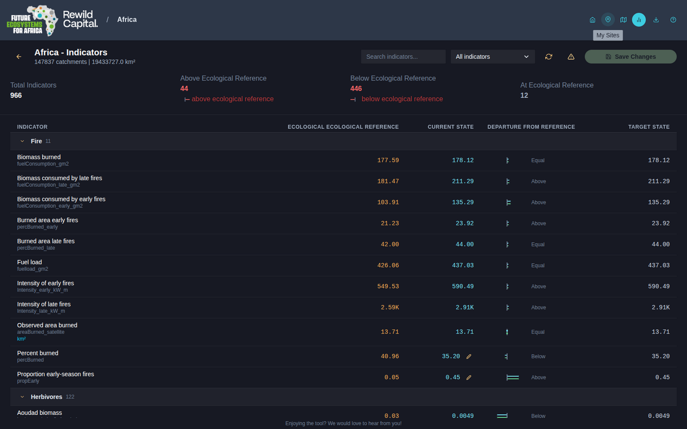

# UI Reference Guide

A widget-by-widget description of every interface component in Decision Theatre.

## Landing Page

The entry point of the application.


| Component | Description |
|-----------|-------------|
| **Header** | Logos (left); **My Sites**, **Download**, **Toggle documentation** icons (right) |
| **Hero section** | "Welcome to the Landscape Decision Dashboard" title, strapline, and the **Explore the Future of Ecosystem Decision-Making** button, which opens [Explore mode](../user-manual/sites.md#explore-mode) |
| **Supporting landscape management** | Auto-advancing screenshot carousel (Dials / Chart / Map / Sites) with descriptive text and **The FEFA and Rewild Capital Partnership** button |
| **Use the Landscape Decision Dashboard to...** | Capability strip and four audience cards, each launching a scripted [guided tour](../user-guide/first-run.md#3-guided-tours) of a pre-built demo site: **Explore Conservation Futures**, **Explore Shared Landscapes**, **Explore Policy Impacts**, **Explore Future Possibilities** |
| **How does it work?** | **Guided Tour** button (replays the app's onboarding walkthrough) plus a reference/current/target explainer |
| **Members of Our Ecosystem** | Auto-advancing carousel of partner-organisation logos |
| **Feedback link** | Persistent footer banner linking to a feedback form (if configured) |

## Onboarding Walkthrough

A small draggable card (bottom-center) with a spotlight ring on the relevant UI element, progress dots, **Back** / **Next**, and **Skip tour**. Runs automatically the first time the app loads in a browser profile; restart it anytime from the landing page's **Guided Tour** button. Covers: Welcome &rarr; My Sites &rarr; Create a Site &rarr; Define Your Boundary &rarr; Your Site on the Map &rarr; Indicators & Scenarios &rarr; View Modes &rarr; Documentation.

## Your Sites Page

Reached via the **My Sites** icon (pin) in the header.


| Component | Description |
|-----------|-------------|
| **Back to Home** | Returns to the Landing page |
| **Create New Site** button | Large primary button, starts the [creation wizard](#create-site-wizard) |
| **Site grid** | Responsive grid of site cards (1-3 columns based on screen size) |
| **Empty state** | "No Sites Yet" card with a **Create Your First Site** button, shown when no sites exist |

### Site Card

| Component | Description |
|-----------|-------------|
| **Thumbnail** | Auto-captured map image, or a gradient placeholder with a pin icon |
| **Edit / Clone / Delete** icons | Appear on hover; hidden entirely for the four read-only demo sites |
| **Title** | Site name (truncated if too long) |
| **Description** | Site description, or "No description" |
| **Created date** | Formatted creation timestamp |

## Create Site Wizard

Three steps, tracked by a stepper in the header (**Method &rarr; Boundary &rarr; Details**); editing an existing site skips straight to a single Details step.

### Step 1: Method


| Card | Description |
|------|-------------|
| **Shapefile** | Upload a `.zip` with `.shp`, `.shx`, `.dbf` |
| **GeoJSON** | Drop a `.geojson` or `.json` file |
| **Draw** | Click points on the map to draw a boundary |
| **Catchments** | Click, or box-select, catchments to merge into one boundary |

### Step 2: Boundary

| Component | Description |
|-----------|-------------|
| **Location search box** | Type a place name (3+ characters) to search; results merge an offline gazetteer with live OpenStreetMap lookups. Clicking a result flies the map there |
| **Satellite basemap toggle** (globe icon) | Switches between the default vector basemap and Google satellite imagery |
| **Instructions banner** | Top-center pill; text changes with the current mode and progress |
| **Undo / Clear** (Draw mode) | Remove the last drawn point, or clear the whole boundary |
| **Box Select** toggle (Catchments mode) | Drag a rectangle to bulk-select every catchment inside it |
| **Clear Selection** (Catchments mode) | Appears once at least one catchment is selected |
| **Confirm Boundary** / **Create Boundary** | Advances to Details once a valid boundary exists; auto-captures a thumbnail |


### Step 3: Details


| Component | Description |
|-----------|-------------|
| **Boundary Ready** chip | Icon, method, and catchment count summary, with an **Edit** link back to Step 2 |
| **Site Title** | Required text field |
| **Description** | Optional multi-line text |
| **Thumbnail** | Drag-and-drop or click-to-browse image upload (max 5MB); hover for Change/Remove |
| **Create Site** / **Save Changes** | Submits the form |

## Main Application (Map View)

### Header Bar

| Component | Description |
|-----------|-------------|
| **Logos** | FEFA / Rewild Capital branding; clickable to return to the Landing page |
| **Site title** | Shown next to a "/" separator once a site is open, with an **Edit site** pencil |
| **Edit site boundary** (pencil, map page only) | Toggles [boundary edit mode](../user-manual/using-the-map.md#editing-a-site-boundary) |
| **Home** icon | Returns to the Landing page |
| **My Sites** icon (pin) | Opens Your Sites |
| **Map view** icon | Returns to the map from the Indicators page |
| **Indicators** icon (bar chart) | Opens the [Indicators page](../user-manual/scenario-comparison.md#the-indicators-page) for the open site |
| **Tiles** status badge | Green when map tile data is loaded, gray when missing |
| **Download** icon (browser runtime only) | Opens the Download page |
| **Reinstall data pack** icon (desktop runtime only) | Reopens the Setup Guide |
| **Documentation** icon | Opens/closes this documentation panel |

### Map View

| Component | Description |
|-----------|-------------|
| **Map canvas** | Two synchronized MapLibre GL JS map instances (one per compared scenario), rendering vector tiles from the local MBTiles |
| **Swipe divider** | Draggable vertical line separating the two scenario maps; docks to an edge when dragged close to it |
| **Choropleth** | Colour overlay for the selected factor, driven by the active colour scale |
| **Site boundary outline** | Magenta outline of the open site's boundary, when a site is loaded |
| **Zoom / compass controls** | Standard MapLibre zoom in/out and bearing-reset, bottom-left |


### Per-Pane Map Toolbar

Floating vertical toolbar, left edge of each map pane:

| Control | Description |
|---------|-------------|
| **Toggle 3D view** | Extrudes catchments as 3D bars scaled to the factor's value, tilting the camera to 60&deg; |
| **Toggle choropleth layer** | Shows/hides the colour overlay |
| **Toggle identify mode** | Click-to-inspect a catchment (single-pane view only) |
| **Toggle Google basemap** | Switches to/from satellite imagery |
| **Toggle map swiper** | Shows/hides the swipe divider |
| **Zoom to Site** | Fits the view to the open site's boundary |


### Per-Pane View-Mode Toolbar

Floating toolbar, bottom-right of each pane -- buttons for every *other* view mode than the one showing (Map / Chart / Dial / Table). In quad view this also offers **Calculation details**, **Focus this pane** (maximise), a **2x2 / 2x3 columns** toggle (first pane only), and **Remove pane** (extra panes only).

### Single and Quad Views

- **Single view** -- one pane fills the content area; its indicator panel opens automatically on the right. Use the grid icon to switch to quad view.
- **Quad view** -- 2x2 or 2x3 grid of independent panes, each with its own factor/scenario/view-mode selections. A shared top toolbar can set **all panes** to one view mode at once, add panes, and open **Targets**.


## Indicator Panel

Slides in from the right (drag its left edge to resize, 320-720px).

| Component | Description |
|-----------|-------------|
| **Create Site** button | Shown only in Explore mode |
| **Indicator** heading + Pane badge | Identifies which pane the panel is editing |
| **Zone Range** | Full / Extent / Site toggle (hidden for Dial view, which has its own inline toggle) |
| **Factor** field | Searchable attribute dropdown (non-chart views) |
| **Individual Factor** / **Variable Type** fields | Chart view only -- pick a single factor, or a category to compare in bulk, with an optional Grouping Variable and Line/Boxplot toggle |
| **Scenario 1 (Left)** / **Scenario 2 (Right)** | Dropdowns for Ecological Reference / Current State / Target State, each with a description and, where available, min/mean/max statistics for the current zone range |
| **Color Scale (Domain Range)** | Scale-type control (currently Linear) and a gradient legend bar |

## View Modes

Switch a pane's view mode from its per-pane toolbar. See [Scenario Comparison](../user-manual/scenario-comparison.md#view-modes) for how to configure each one.

| Mode | Shows |
|------|-------|
| **Map** | Choropleth map, described above |
| **Chart** |  Line or boxplot comparison of Reference/Current/Target for one factor, or a whole Variable Type category |
| **Dial** |  Gauge showing Current and Target relative to the Ecological Reference band |
| **Table** |  Site Aggregate Calculation -- area-weighted average, with an optional per-catchment breakdown |

## Targets Modal

Opened via the **Targets** button in the quad-view toolbar, once a site has indicators.


| Component | Description |
|-----------|-------------|
| **Category accordion** | Collapsible groups (e.g. Fire, Herbivores, Vegetation Structure) with an indicator count |
| **Slider rows** | One per indicator, showing current value, unit, and min/max range |
| **Cancel / Save** | Save applies only the sliders actually moved |

## Indicators Page

Reached via the header's **Indicators** icon.



| Component | Description |
|-----------|-------------|
| **Summary stats** | Total Indicators, Above/Below/At Ecological Reference counts |
| **Search box / category filter** | Narrow the indicator table |
| **Refresh** | Re-extracts indicators from the site's catchments |
| **Reset** | Reverts every Target value back to Current (confirmation required) |
| **Save Changes** | Enabled once a value has been edited |
| **Indicator table** | Grouped, collapsible rows: Ecological Reference / Current State / departure trend glyph / Target State, with inline edit (pencil) on editable cells |
| **Extract Indicators** | Shown instead of the table when the site has no indicators yet |

## Boundary Edit Mode

Toggled from the header's pencil icon, map page only.


| Component | Description |
|-----------|-------------|
| **Edit Mode banner** | Names the current sub-mode |
| **Add / Remove catchments** | Green + / red &minus; buttons; click a catchment to union/subtract it |
| **Add / Delete vertices** | Blue + / orange trash buttons; click the boundary to insert a vertex, or a vertex to delete it |
| **Vertex handles** | Glowing cyan dots; drag directly to reshape when no tool is selected |

Edits auto-apply as you go -- there is no separate save step.

## Navigation Flow

```
Landing Page
├── Guided Tour (onboarding walkthrough overlay)
├── Explore → Map View (no site)
├── Demo tour cards → Map View (read-only demo site)
├── Partnership Page
│   └── Back to Landing
└── My Sites
    ├── Create New Site → 3-step wizard → Map View
    └── Site Card (click) → Map View
        ├── Home icon → Landing Page
        ├── My Sites icon → Your Sites
        └── Indicators icon → Indicators Page
```
