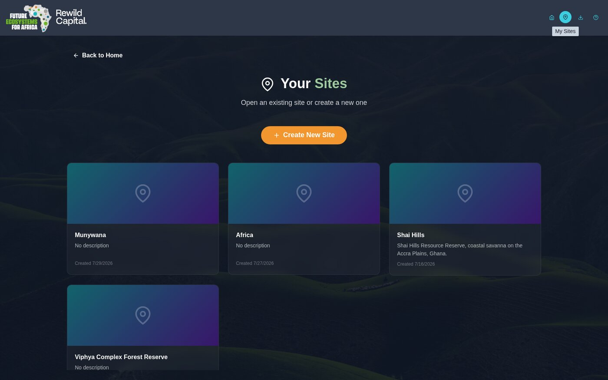
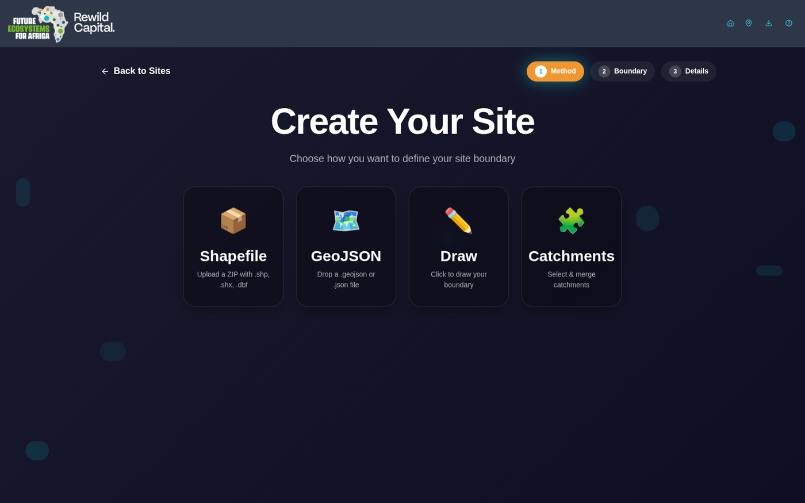
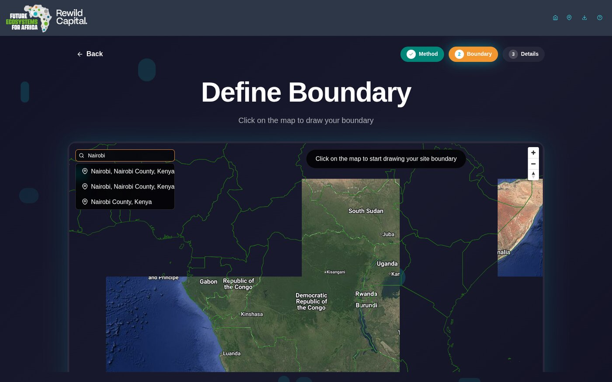
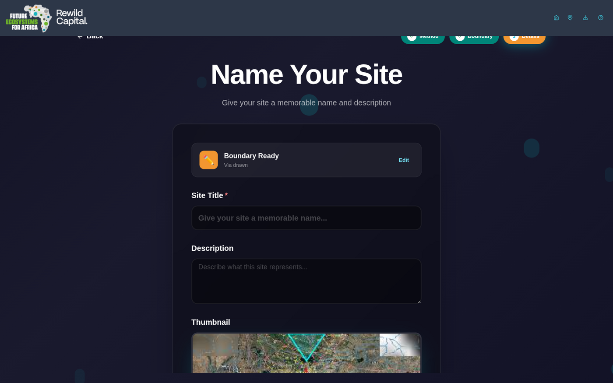

# Sites

A **site** is a saved study area -- a boundary you define once, then reuse for scenario comparison, charts, dials, and indicator editing. Each site stores its own boundary, view layout, and indicator values.

## Your Sites

Click the pin icon (**My Sites**) in the header, or **Explore the Future of Ecosystem Decision-Making** on the landing page, to reach **Your Sites**. From here you can open an existing site or create a new one.

Each site card shows a thumbnail (auto-captured from the map, or a gradient placeholder if none was set), title, description, and creation date. Hovering over a card reveals **Edit**, **Clone**, and **Delete** icon buttons; clicking the card body opens the site.

If you have no sites yet, an empty state offers a **Create Your First Site** button.

!!! note "Read-only demo sites"
    Four sites -- **Africa**, **Munywana**, **Shai Hills**, and **Viphya Complex Forest Reserve** -- ship with the app to support the [guided tours](../user-guide/first-run.md#3-guided-tours). These are marked read-only: they never show edit/clone/delete controls, since they're meant to stay in their demo state. Open one to explore fully-populated example data without creating your own site first.

## Creating a Site

Click **Create New Site** and work through three steps:

### 1. Method

Choose how to define the site boundary:

| Method | Description |
|--------|-------------|
| **Shapefile** | Upload a `.zip` containing `.shp`, `.shx`, and `.dbf` |
| **GeoJSON** | Drop a `.geojson` or `.json` file |
| **Draw** | Click points on the map to draw a boundary by hand |
| **Catchments** | Click (or box-select) individual catchments and merge them into one boundary |

### 2. Boundary

The map-based boundary editor offers a few shared tools regardless of method:

- **Location search** -- type at least 3 characters into the search box (top-left) to look up a place by name. Results combine a bundled offline gazetteer of major African cities with live results from OpenStreetMap for smaller towns (skipped automatically if you're offline). Click a result to fly the map there.

  

- **Satellite basemap toggle** (globe icon) -- switch between the default vector basemap and Google satellite imagery to help orient yourself.

**Draw**: click to place at least 3 points on the map; **Undo** and **Clear** buttons (bottom-left) let you correct mistakes.

**Catchments**: click individual catchments to toggle them into the selection, or turn on **Box Select** to drag a rectangle and select every catchment inside it. Zoom in until catchment boundaries are visible on the map before selecting. A **Clear Selection** button appears once you've picked at least one catchment.

**Shapefile / GeoJSON**: after upload, the map shows the parsed boundary for review.

Once a valid boundary exists, click **Confirm Boundary** (or **Create Boundary** for the Catchments method) to continue. This also auto-captures a map screenshot to use as the site's thumbnail.

### 3. Details

Give the site a **Title** (required) and optional **Description**, and confirm or replace the auto-captured **Thumbnail** (drag-and-drop or click to browse, max 5MB). Click **Create Site** to finish -- you'll land directly in the map view for your new site.

## Editing a Site

Click the pencil icon on a site card (or the pencil next to the site title in the header, on the map page) to edit its title, description, and thumbnail. To reshape the boundary itself, see [Editing a boundary](using-the-map.md#editing-a-site-boundary) in Using the Map.

## Cloning a Site

Hover over a site card and click the **Clone** icon (copy). This pre-fills the creation wizard's Details step with the original site's boundary and settings under a new title (`{title} (Copy)`) -- adjust as needed and click **Create Site**.

## Deleting a Site

Hover over a site card and click the **Delete** icon (trash). Confirm in the dialog that appears. Deletion is permanent.

## Explore Mode

If you want to browse the full dataset without committing to a site boundary yet, click **Explore the Future of Ecosystem Decision-Making** on the landing page. This opens the map with the indicator panel already open and no site loaded -- zone range is limited to **Full** (the whole domain) or **Extent** (current map view), since there's no site to aggregate to. A **Create Site** button in the panel lets you turn your exploration into a saved site at any point.
