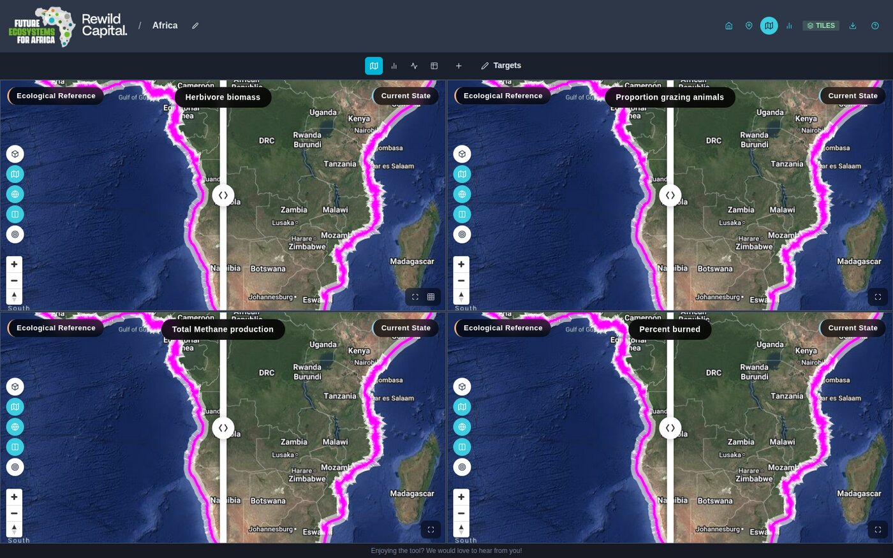

# Using the Map

Once you've opened or created a [site](sites.md) (or entered Explore mode), you land in the map view -- the core workspace for comparing scenarios.

## Header

- **Home** -- return to the landing page
- **My Sites** (pin icon) -- back to Your Sites
- **Map view** / **Indicators** (bar-chart icon) -- switch between the map workspace and the full [Indicators](scenario-comparison.md#the-indicators-page) page for the open site
- **Tiles** status badge -- green when map tile data is loaded
- **Edit site boundary** (pencil, map page only) -- toggles [boundary editing](#editing-a-site-boundary)
- **Documentation** (help icon) -- opens this documentation panel alongside the app

## Layout: Single and Quad

- **Single view** -- one pane fills the content area. The indicator panel opens automatically on the right for choosing scenarios and a factor. A **grid icon** on the pane's toolbar switches to quad view.
- **Quad view** -- a 2x2 (or 2x3, via the columns toggle) grid of independent panes, each with its own factor, scenario, and view mode. Click the **maximise icon** on any pane to focus it as a single pane and open its indicator panel; click **Add pane** (+) in the quad toolbar to add more.

In quad view, a toolbar above the grid lets you set **all panes at once** to Map, Chart, Dial, or Table, and (once a site has indicators with editable targets) opens the **Targets** modal -- see [Setting target values](scenario-comparison.md#setting-target-values).

Each pane's own toolbar (bottom-right) switches that pane between **Map**, **Chart**, **Dial**, and **Table** view -- see [Scenario Comparison](scenario-comparison.md) for what each view shows and how to configure it.

## Map Controls

Each map pane has its own floating toolbar (left side) and standard zoom/compass controls (bottom-left):

| Control | Description |
|---------|-------------|
| **Toggle 3D view** (cube icon) | Tilts the camera to a 60&deg; pitch and extrudes catchments as 3D bars scaled to the selected factor's value |
| **Toggle choropleth layer** (map icon) | Shows or hides the coloured data overlay |
| **Toggle identify mode** (info icon, hidden in quad view) | Click-to-inspect a catchment -- see [Identifying a catchment](#identifying-a-catchment) |
| **Toggle Google basemap** (globe icon) | Switches between the default vector basemap and Google satellite imagery |
| **Toggle map swiper** (columns icon) | Shows or hides the draggable swipe divider between the two compared scenarios |
| **Zoom to Site** (target icon, only with a site loaded) | Fits the map to the site boundary |

### The swipe divider

Decision Theatre always renders two synchronized map instances -- one per compared scenario. The vertical divider between them is a draggable handle: drag it left or right to reveal more of either side. It snaps ("docks") fully to one edge when dragged within about 3% of it. Floating labels along the top name each scenario and the active factor.

### Identifying a catchment

With identify mode on, click any catchment to open a popup showing every attribute for that catchment across the left and right scenarios, plus its departure from the ecological reference. Click the site boundary line itself instead to see site-wide indicator values. Close the popup with its **&times;** button. Identify mode is only available in single-pane view.

## Editing a Site Boundary

Click the pencil icon (**Edit site boundary**) in the header, on the map page, to enter boundary edit mode. A banner explains the current tool, and a floating panel (top-right of the pane) offers two independent tool pairs:

- **Add / Remove catchments** (green + / red &minus;) -- click a catchment to union or subtract it from the boundary
- **Add / Delete vertices** (blue + / orange trash) -- click the boundary line to insert a vertex, or click an existing vertex to remove it

With no tool selected, drag the glowing cyan vertex handles directly to reshape the boundary.

!!! warning "No confirm step"
    Boundary edits apply immediately as you drag or click -- there's no separate Save or Cancel. Click the pencil icon again to exit edit mode when you're done; if the boundary changed, indicators are automatically re-extracted for the new shape.
